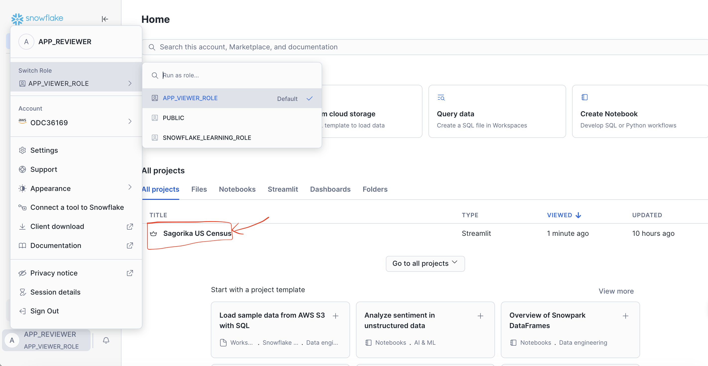

# US Census Chat Agent (Snowflake + Streamlit)

A chat-based agent that answers US Census questions using the Snowflake Marketplace dataset **US Open Census Data & Neighborhood Insights (Free Dataset)**. The agent writes SQL against curated gold views, validates it, executes it, and synthesizes a natural-language answer.

## Demo / Access (Snowflake Streamlit)

This app is deployed as a **Streamlit app inside Snowflake** (no local setup required).

### Use the viewer login provided

1) Log in to Snowflake using: 
- **Account / Server URL:** [NDCPYYH-ODC36169.snowflakecomputing.com](https://ndcpyyh-odc36169.snowflakecomputing.com/)  
- **Username:** APP_REVIEWER  
- **Password:** snowflakeai!  
- **Role:** APP_VIEWER_ROLE  
- **Warehouse:** COMPUTE_WH  

2) Open the app link (viewer mode) or click on Sagorika US Census Streamlit App from the dashboard:
- https://app.snowflake.com/streamlit/us-east-1/zcc13934/#/apps/w4jolvua4louq7emdedh



- The app queries read-only curated views from `SNOWFLAKE_LEARNING_DB.PUBLIC`.

## How the agent works

```
User -> Guardrails (NSFW + off-topic) -> SQL Agent (Claude 3.5 Sonnet)
     -> SQL Validator (safety + column check) -> Execute (Snowpark)
     -> Answer Synthesizer (Llama 3.1 8B) -> UI
```

- **SQL Agent**: LLM receives the full view catalog (names + columns + descriptions) and writes a SELECT query directly. The prompt natively requests readable layman titles (aliases) for table headers.
- **Validator**: SELECT-only, approved views only, LIMIT required, column allowlist enforced (stripping aliases safely). Non-negotiable.
- **Fallback**: If the LLM's SQL fails validation, a deterministic router + compiler produces a guaranteed-valid backend query.
- **Synthesizer**: Second LLM call turns results into a natural-language answer with key findings and caveats.

## What it can answer

1. **Rent burden**: Where do residents spend over 30% of income on rent?
2. **Commute**: Which states have the longest average commutes?
3. **Migration**: Which places have the highest inflow? (county/county-equivalents, clarifies when "city" is requested)
4. **Language**: Top states with non-English speaking populations (household-based)
5. **Plus**: population by sex, tenure, labor force, race, hispanic, education (2020 state-level)
6. **Year compare**: Side-by-side 2019 vs 2020

## Guardrails

- NSFW filter (regex) before any LLM call
- **Semantic Topic Guardrail**: Uses Snowflake Cortex vector embeddings (`VECTOR_COSINE_SIMILARITY`) to measure the mathematical semantic closeness between the user's prompt and a baseline demographics concept. Dynamically rejects off-topic queries without relying on brittle keyword lists.
- **Conversational Handlers**: Recognizes greetings, identity questions, and gratitude without triggering errors or hitting the SQL agent.
- SQL validator: SELECT-only, banned DDL/DML, no metadata schemas, approved views only, LIMIT required
- Column allowlist: catches hallucinated column names (the #1 text-to-SQL failure mode), correctly splitting out dynamic AS aliases.
- Capability gate: explains when household-based language data can't answer person-by-sex questions

## Repo structure

```text
├── streamlit_app.py        # Root entry point wrapper
├── environment.yml         # Conda environment definition
├── requirements.txt        # Python dependencies
├── .env                    # (Optional) Local Snowflake credentials
├── app/
│   ├── streamlit_app.py    # Main UI orchestrator
│   ├── config.py           # Views, models, column catalog, constants
│   ├── pipeline/           # Deterministic components
│   │   ├── guardrails.py   # NSFW, semantic semantic vector scope, capability gate
│   │   ├── router.py       # Deterministic topic/geo routing
│   │   ├── compiler.py     # Deterministic SQL builder
│   │   ├── validator.py    # SQL safety + column allowlist
│   │   ├── executor.py     # Snowpark query runner
│   │   └── explainer.py    # One-line summary
│   ├── llm/
│   │   ├── sql_agent.py    # Text-to-SQL via Cortex (claude-3-5-sonnet)
│   │   ├── synthesizer.py  # Answer synthesis via Cortex (llama3.1-8b)
│   │   └── planner.py      # Legacy JSON-spec planner (fallback path)
│   └── helpers/
│       ├── conversation.py # Session-state wrappers
│       ├── query_spec.py   # Spec schema (fallback path)
│       └── policies/
│           ├── year_policy.py
│           └── migration_policy.py
├── tests/                  # 49 tests, pure Python
├── sql/                    # View DDL + verification queries
└── docs/                   # This README + dev_process.md
```

## Running tests

```bash
source .venv/bin/activate
python -m pytest tests/ -v
```

## Production upgrade path

For production, we can consider **Snowflake Cortex Analyst** - Snowflake's purpose-built text-to-SQL service with a semantic model YAML. It handles SQL generation, validation, and grounding internally. The curated views built here would map directly to a Cortex Analyst semantic model.